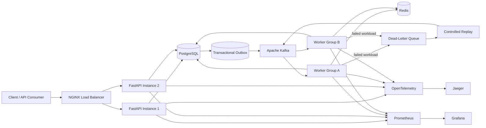

<!-- =========================
     PROFILE HEADER
========================== -->

 

 

---

## 👨‍💻 About Me

I am a **Backend Software Engineer with 3+ years of experience** building Java and Spring Boot microservices, REST APIs, asynchronous integrations, database-driven applications, workflow automation, and production-support solutions.

My experience spans:

- Enterprise Java backend engineering for **USAA claims systems through Tata Consultancy Services**
- Python automation and internal web and data tools at the **University of Florida**
- Distributed job processing with **FastAPI, Kafka, PostgreSQL, Redis, Kubernetes, and observability tooling**
- Production troubleshooting, database optimization, secure credential management, CI/CD, monitoring, and reliability engineering

I enjoy solving problems where systems must remain **reliable, observable, secure, and recoverable under failure**.

---

## 📌 Engineering Snapshot

<table>
<tr>
<td width="50%" valign="top">

### Current Work

**Web Application Developer**  
University of Florida — Transportation & Parking Services

- Build Python automation and internal operational tools
- Develop PostgreSQL validation and reconciliation workflows
- Automate payment-plan, permit, validator, and account workflows with Python, Selenium, and OpenPyXL
- Replace repetitive, error-prone manual work with reliable, auditable workflows
- Support testing, troubleshooting, deployment validation, and production operations

</td>
<td width="50%" valign="top">

### Previous Production Experience

**Assistant Systems Engineer · Java Backend Developer**  
Tata Consultancy Services — Client: USAA

- Built Java 8 and Spring Boot microservices
- Integrated REST APIs and IBM MQ workflows
- Optimized Oracle SQL and connection-pool behavior
- Reduced API latency by **35%**
- Improved response time from **850 ms to 550 ms**
- Supported business-critical production claims applications

</td>
</tr>
</table>

---

# 🚀 Featured Engineering Projects

## 🧩 Distributed Intelligence Runtime

### Distributed Event-Driven Job Processing Platform

A production-style platform for submitting, scheduling, tracking, and executing asynchronous and long-running workloads through independently scalable API and worker services.

### Core Capabilities

- **Event-driven processing:** FastAPI services communicate through Apache Kafka
- **Reliable publishing:** PostgreSQL-to-Kafka delivery using the transactional outbox pattern
- **Failure recovery:** retries, dead-letter queues, controlled replay, and transient-failure handling
- **Safe consumption:** consumer groups and idempotent processing
- **Job lifecycle management:** pending, queued, running, retrying, completed, failed, dead-lettered, and cancelled states
- **Security:** JWT authentication, RBAC, protected routes, centralized authorization, and audit trails
- **Traffic protection:** rate limiting, circuit breakers, and timeout controls
- **Infrastructure:** Docker, NGINX load balancing, Kubernetes service discovery, health checks, readiness probes, and horizontal scaling
- **Observability:** OpenTelemetry, Jaeger, Prometheus, Grafana, structured logging, metrics, and distributed tracing
- **Validation:** load testing, stress testing, and controlled failure simulations

### Architecture

**Stack:** `Python` · `FastAPI` · `Apache Kafka` · `PostgreSQL` · `Redis` · `pgvector` · `Docker` · `Kubernetes` · `NGINX` · `JWT / RBAC` · `OpenTelemetry` · `Jaeger` · `Prometheus` · `Grafana`

---

## ⚡ Distributed Reddit Backend Engine

### Multithreaded C++ / PostgreSQL Backend

A multithreaded backend modeling core Reddit-style social features, built to explore concurrency and throughput under load.

### Core Capabilities

- **Features:** post creation, voting, threaded comments, community membership, and feed generation
- **Concurrency:** thread-safe data structures, synchronization controls, and connection management for parallel request handling
- **Throughput:** tested up to **1,000 concurrent connections** with sub-50 ms response times on benchmarked operations in a local test environment

**Stack:** `C++` · `PostgreSQL` · `Multithreading` · `Concurrency` · `Rate Limiting`

> 🔎 More projects — Task Manager, LLM Portfolio, Crime Data Analysis, GatorLibrary, SkillArcade, and Semantic Segmentation — on my [**portfolio**](https://sreenivasarajukonduru.github.io/Portfolio/).

---

## 🎓 Education & Certifications

- 🎓 **M.S. Computer Science** — University of Florida (2025)
- 🎓 **B.E. Computer Science Engineering** — Sathyabama Institute of Science & Technology
- 📜 **AWS Certified Solutions Architect – Associate**
- 📜 **Salesforce Platform Developer I**

---

## 📊 GitHub Stats

---

### 💬 Let's connect

I'm open to **backend, platform, and full-stack SDE roles** — happy to walk through any project here, especially the **Distributed Intelligence Runtime**.

